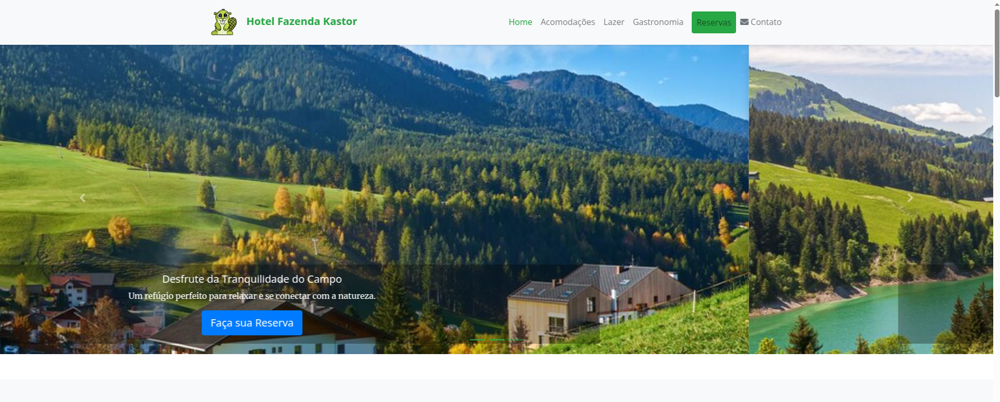
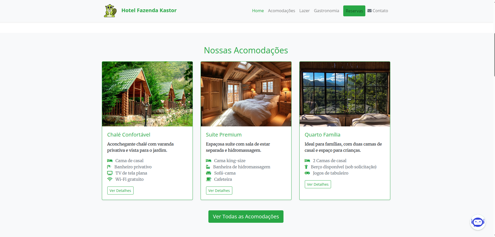
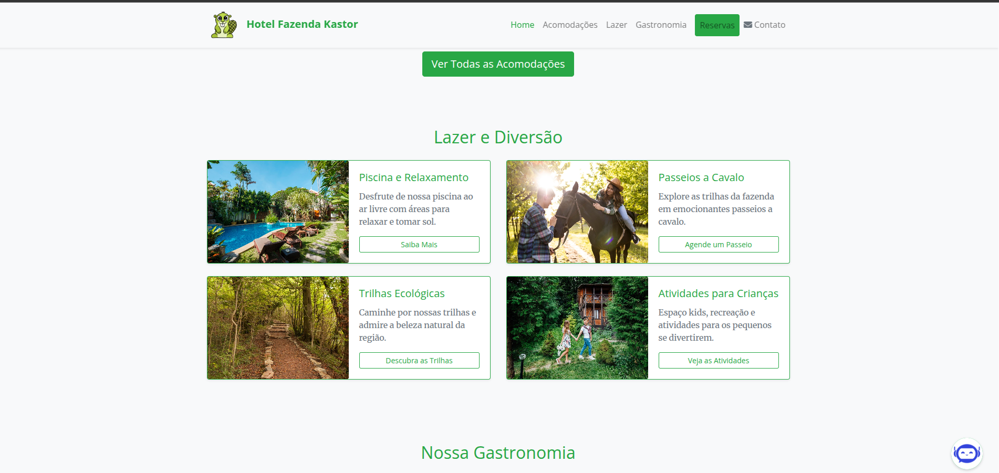

<!DOCTYPE html>
<html lang="pt-br">
<head>
    <meta charset="UTF-8">
    <meta name="viewport" content="width=device-width, initial-scale=1.0">
    <meta name="description" content="Documentação do Website do Hotel Fazenda Kastor, construído com HTML, Bootstrap e outras tecnologias.">
    <meta name="keywords" content="HTML, Bootstrap, Hotel Fazenda Kastor, website, responsivo">
    <meta name="author" content="Ana Alice Rodrigues">
</head>
<body>

<header>
    <h1>Website Hotel Fazenda Kastor</h1>
    
Documentação do website desenvolvido para o Hotel Fazenda Kastor, utilizando HTML, Bootstrap e outras tecnologias para criar uma experiência online informativa e atraente.

    
    
    
</header>

    
Índice

    <ol>
        <li><a href="#conteudo">Conteúdo do Website</a></li>
        <li><a href="#estrutura-codigo">Estrutura do Código HTML</a></li>
        <li><a href="#css">CSS</a></li>
        <li><a href="#javascript">JavaScript</a></li>
        <li><a href="#uso">Uso</a></li>
        <li><a href="#recursos">Recursos Utilizados</a></li>
        <li><a href="#proximos-passos">Próximos Passos</a></li>
        <li><a href="#contribuicao">Contribuição</a></li>
        <li><a href="#licenca">Licença</a></li>
        <li><a href="#contato">Contato</a></li>
    </ol>

<section id="conteudo">
    <h2>Conteúdo do Website</h2>
    <ul>
        <li><strong>Barra de Navegação:</strong> Uma barra de navegação responsiva que permite aos usuários acessar as principais seções do site (Home, Acomodações, Lazer, Gastronomia, Reservas, Contato).</li>
        <li><strong>Carousel de Imagens (Header):</strong> Um carrossel na seção de cabeçalho exibindo imagens do hotel e chamadas para ação (reservas, conhecer acomodações, etc.).</li>
        <li><strong>Seção de Acomodações:</strong> Cartões apresentando os diferentes tipos de acomodações disponíveis com imagens, descrições e detalhes.</li>
        <li><strong>Seção de Lazer:</strong> Cartões ou blocos destacando as atividades de lazer oferecidas pelo hotel (piscina, cavalgada, trilhas, etc.).</li>
        <li><strong>Seção de Gastronomia:</strong> Um carrossel ou galeria apresentando as opções de alimentação e destaques da culinária do hotel.</li>
        <li><strong>Seção de Reservas:</strong> Um formulário interativo para os usuários verificarem a disponibilidade e fazerem reservas.</li>
        <li><strong>Seção de Contato:</strong> Informações de contato do hotel, incluindo um mapa de localização e um formulário de contato.</li>
        <li><strong>Chatbot (Seção):</strong> Uma seção dedicada à funcionalidade do chatbot para assistência aos usuários.</li>
        <li><strong>Rodapé:</strong> Informações de rodapé contendo a logo, informações de contato, links de navegação, newsletter e direitos autorais.</li>
    </ul>
</section>

<section id="estrutura-codigo">
    <h2>Estrutura do Código HTML</h2>
    
O arquivo <code>index.html</code> contém a estrutura semântica do website, utilizando divs, sections e outras tags HTML5 para organizar o conteúdo de forma lógica.

    
O Bootstrap é utilizado para o sistema de grid (organização em colunas) e para diversos componentes da interface, como a barra de navegação, o carrossel e os cartões.

    </section>

<section id="css">
    <h2>CSS</h2>
    
O estilo principal é fornecido pelo Bootstrap, através de um link CDN no `<head>` do arquivo HTML.

    
Um arquivo CSS personalizado (`style.css`) é utilizado para adicionar estilos específicos do tema do Hotel Fazenda e para sobrepor estilos do Bootstrap quando necessário.

    </section>

<section id="javascript">
    <h2>JavaScript</h2>
    
O Bootstrap utiliza JavaScript para algumas de suas funcionalidades interativas, como o carrossel e o menu responsivo. Estes scripts são incluídos através de links CDN no final do `<body>`.

    
Um arquivo JavaScript personalizado (`chatbot.js`) é utilizado para a lógica e o comportamento do chatbot (se implementado).

    
jQuery e Popper.js são incluídos, pois são dependências do Bootstrap.

    </section>

<section id="uso">
    <h2>Uso</h2>
    
Para visualizar o website, basta acessar o seguinte link:

    <ul>
        <li></li>
    </ul>
    
</section>

<section id="recursos">
    <h2>Recursos Utilizados</h2>
    <ul>
        <li> Framework de código aberto para design responsivo.</li>
        <li> Biblioteca de ícones para elementos visuais.</li>
        <li> Serviço para importar as fontes Merriweather e Open Sans.</li>
        <li>Imagens: Utilizadas para ilustrar as acomodações, o lazer, a gastronomia e a paisagem do hotel (localizadas na pasta <code>img/</code>). <strong>Você pode adicionar uma breve descrição de algumas imagens importantes aqui, se desejar.</strong></li>
        <li>(Possivelmente outras bibliotecas ou recursos que foram utilizados).</li>
    </ul>
</section>

<section id="proximos-passos">
    <h2>Próximos Passos</h2>
    <ul>
        <li>Implementar a lógica completa do formulário de reserva.</li>
        <li>Desenvolver e integrar a funcionalidade do chatbot.</li>
        <li>Adicionar mais detalhes e informações nas seções de acomodações, lazer e gastronomia.</li>
        <li>Otimizar as imagens para melhor desempenho do site.</li>
        <li>Testar a responsividade em diferentes dispositivos e tamanhos de tela.</li>
        <li>(Outros passos específicos do seu projeto).</li>
    </ul>
</section>

<section id="contribuicao">
    <h2>Contribuição</h2>
    
Contribuições para o desenvolvimento e melhorias do website são bem-vindas. Sinta-se à vontade para sugerir alterações e melhorias.

</section>

<section id="licenca">
    <h2>Licença</h2>
    
O projeto do website do Hotel Fazenda Kastor pode estar sob uma licença específica. Consulte o arquivo de LICENÇA (se existente) para mais detalhes.

</section>

<section id="contato">
    <h2>Contato</h2>
    <ul>
        <li></li> 
    </ul>
</section>

</body>
</html>